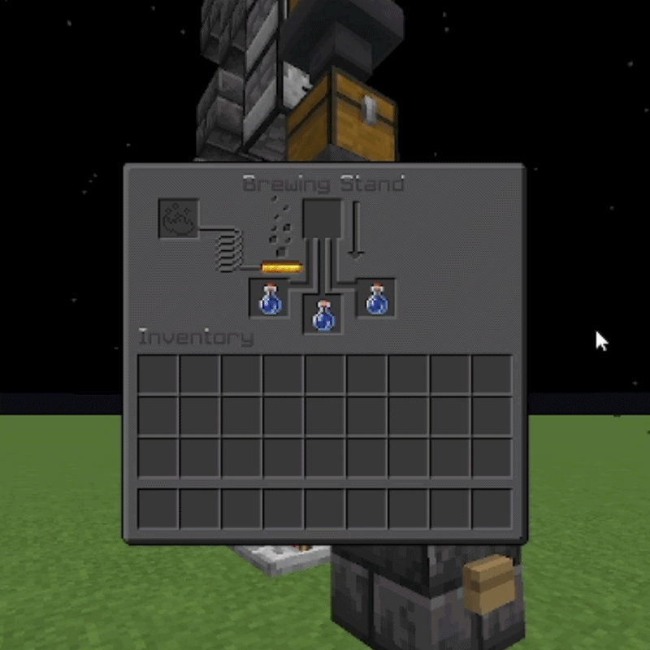

# InstantBrew

[](https://github.com/instantbrew/instantbrew)
[](https://papermc.io/)
[](https://papermc.io/software/folia)

Configure brewing stand speed and behaviour. Set near-instant potions, optional infinite blaze powder, and smarter shift-clicking.

[](https://discord.gg/WpYZkrdNVe)

### Instant brewing & infinite blaze powder



Potions complete immediately when you add an ingredient. With `blaze-powder-infinite` enabled, the fuel bar stays full and blaze powder is never consumed.

### Configurable brew delay

Set `brew-delay-ticks` in the config to add a delay (e.g. `20` = 1 second, `200` = 10 seconds). The brewing progress arrow animates over the configured time before potions complete.

---

## Features

- **Configurable brew delay** — Set brew time in ticks (0 = near-instant, 20 = 1 second)
- **Infinite blaze powder** — Fuel bar stays full and blaze powder is never consumed (optional)
- **Shift-click to ingredient** — Blaze powder goes straight into the ingredient slot instead of the fuel slot (optional)
- **Hot reload** — Change config and reload without restarting the server

---

## Installation

1. Drop `InstantBrew-1.0.0.jar` into your server's `plugins` folder
2. Start or restart the server
3. Edit `plugins/InstantBrew/config.yml` to your liking
4. Use `/instantbrew reload` to apply changes — no restart needed

---

## Usage

### Commands

| Command | Permission | Description |
|---------|------------|-------------|
| `/instantbrew` | — | Shows usage |
| `/instantbrew reload` | `instantbrew.reload` | Reloads the config |

### Permissions

| Permission | Default | Description |
|------------|---------|-------------|
| `instantbrew.reload` | op | Reload config with `/instantbrew reload` |

---

## Configuration

All options live in `plugins/InstantBrew/config.yml`:

| Option | Description |
|--------|-------------|
| `brew-delay-ticks` | Time until brewing finishes. 20 ticks = 1 second. Use 0 for near-instant. |
| `blaze-powder-infinite` | When true, fuel never drains and blaze powder isn't consumed. |
| `blaze-powder-shift-click-to-ingredient` | When true, shift-clicking blaze powder puts it in the ingredient slot. When false, vanilla behaviour. |

**Example config:**

```yaml
brew-delay-ticks: 0
blaze-powder-infinite: false
blaze-powder-shift-click-to-ingredient: false  # true = shift-click puts blaze powder in ingredient slot
```

---

## Compatibility

Works on **Paper**, **Folia**, and **Spigot** (1.21+). One JAR for all.

---

## Building

Requires Java 21.

```bash
./gradlew build
```

Output: `build/libs/InstantBrew-1.0.0.jar`

> **Note for developers:** Replace `BSTATS_PLUGIN_ID` in `InstantBrewPlugin.java` with your plugin ID from [bStats](https://bstats.org/add-plugin) after registering.

---

## bStats

This plugin uses [bStats](https://bstats.org/) to collect anonymous usage statistics (e.g. server software, Minecraft version). This helps with development and is fully optional — you can disable it in the `bstats` config under your server's `plugins` folder.
